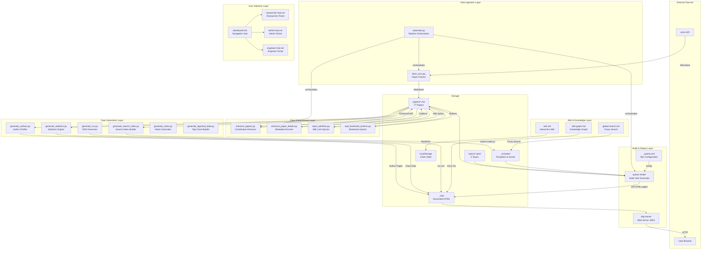
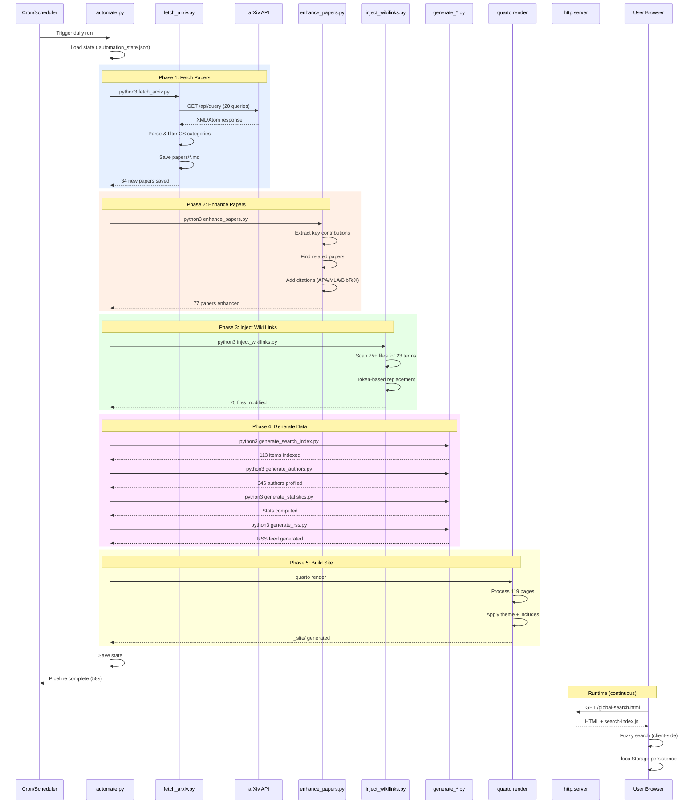
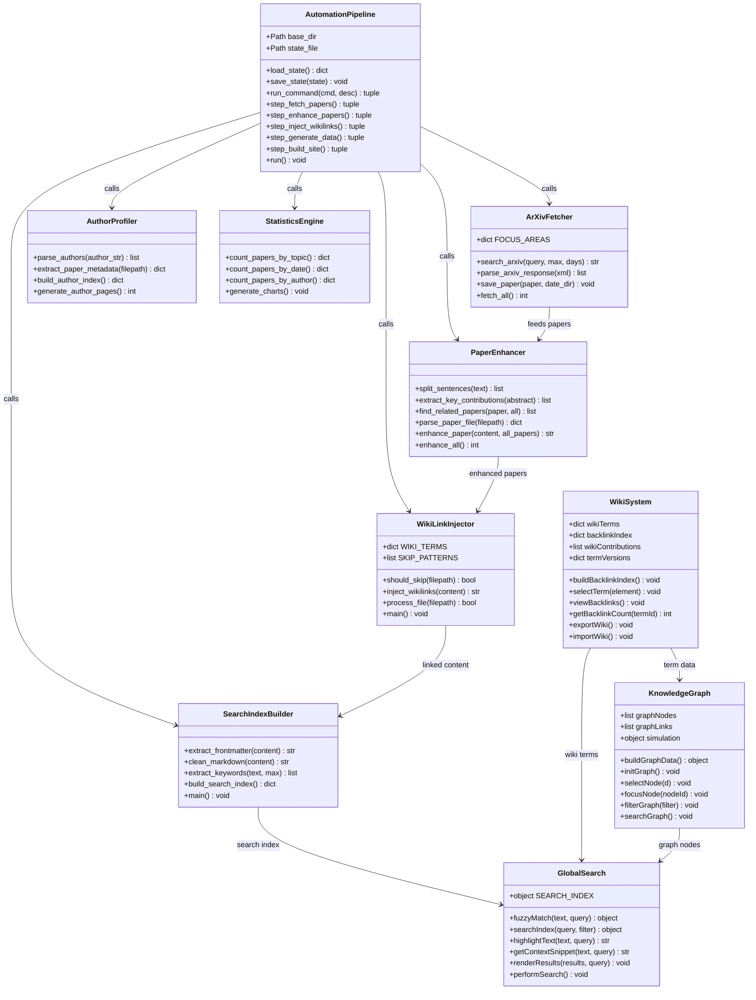
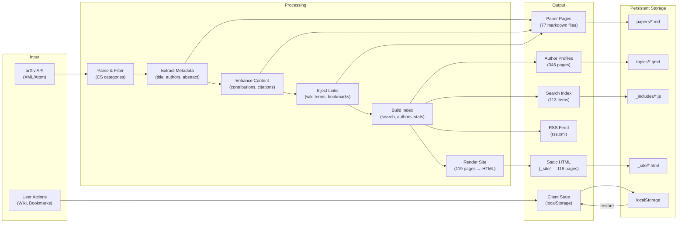
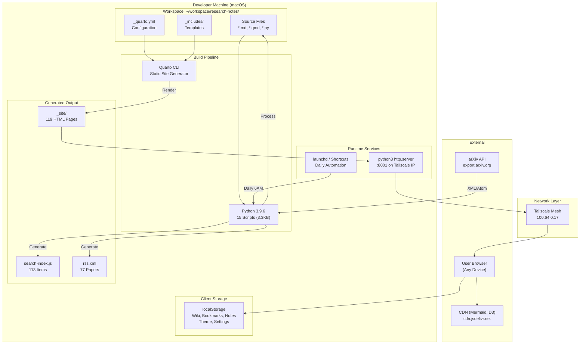

<h2>🏗️ System Architecture</h2>

Interactive UML diagrams showing system design, components, and data flow

<button class="arch-tab active" data-tab="component" onclick="switchTab('component')">📦 Component</button>
<button class="arch-tab" data-tab="sequence" onclick="switchTab('sequence')">🔄 Sequence</button>
<button class="arch-tab" data-tab="class" onclick="switchTab('class')">📐 Class</button>
<button class="arch-tab" data-tab="dataflow" onclick="switchTab('dataflow')">🌊 Data Flow</button>
<button class="arch-tab" data-tab="deployment" onclick="switchTab('deployment')">🚀 Deployment</button>

<h3>Component Diagram</h3>

Shows the high-level system components and their relationships

<h3>Sequence Diagram — Automation Pipeline</h3>

Shows the step-by-step execution flow of the daily automation pipeline

<h3>Class Diagram — Python Module Architecture</h3>

Shows the class structure and relationships between Python modules

<h3>Data Flow Diagram</h3>

Shows how data transforms through the system

<h4>📊 Data Transformation Summary</h4>
<table class="stats-table">
<tr><th>Stage</th><th>Input</th><th>Output</th><th>Transform</th></tr>
<tr><td>Fetch</td><td>arXiv XML</td><td>77 .md files</td><td>Parse, filter, format</td></tr>
<tr><td>Enhance</td><td>Raw abstracts</td><td>Structured summaries</td><td>NLP extraction</td></tr>
<tr><td>Wiki Links</td><td>75 markdown files</td><td>75 linked files</td><td>Token replacement</td></tr>
<tr><td>Search Index</td><td>All content</td><td>113 indexed items</td><td>Keyword extraction</td></tr>
<tr><td>Authors</td><td>77 papers</td><td>346 profiles</td><td>Author parsing</td></tr>
<tr><td>Render</td><td>119 .md/.qmd</td><td>119 .html files</td><td>Quarto processing</td></tr>
</table>

<h3>Deployment Diagram</h3>

Shows the runtime infrastructure and deployment topology

<h4>🖥️ Runtime Environment</h4>
<table class="stats-table">
<tr><th>Component</th><th>Technology</th><th>Details</th></tr>
<tr><td>OS</td><td>macOS 26.6.2</td><td>Host machine</td></tr>
<tr><td>Python</td><td>3.9.6</td><td>/usr/bin/python3</td></tr>
<tr><td>Quarto</td><td>Latest</td><td>Static site generator</td></tr>
<tr><td>Web Server</td><td>python3 http.server</td><td>Port 8001, Tailscale IP</td></tr>
<tr><td>Network</td><td>Tailscale</td><td>100.64.0.17:8001</td></tr>
<tr><td>Automation</td><td>launchd / Shortcuts</td><td>Daily pipeline</td></tr>
<tr><td>Client Storage</td><td>localStorage</td><td>~5MB limit</td></tr>
<tr><td>CDN</td><td>jsdelivr</td><td>Mermaid v10, D3 v7</td></tr>
</table>

